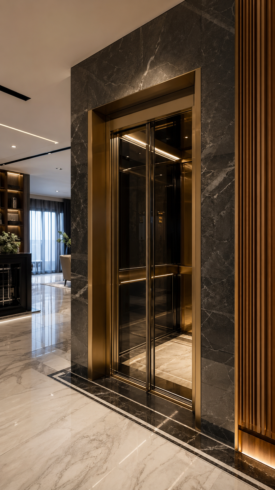
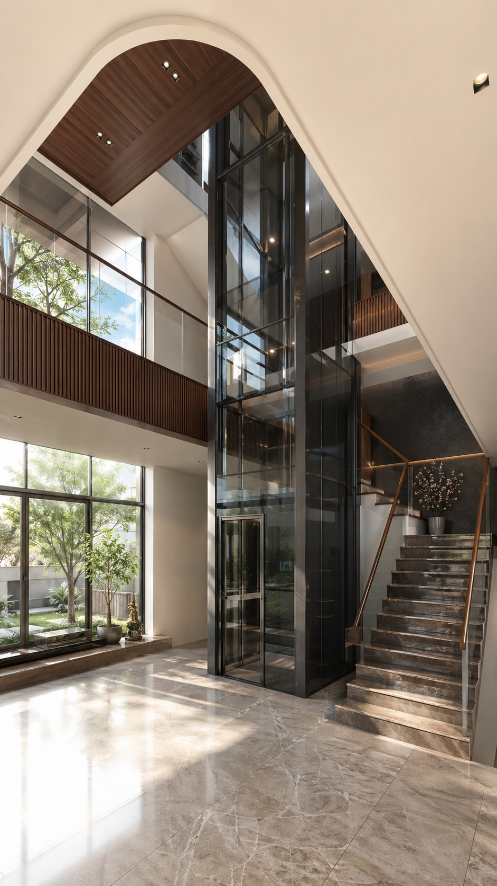
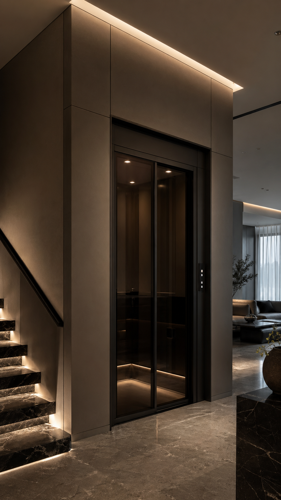

# Thời Gian Lắp Đặt Thang Máy Gia Đình Mất Bao Lâu? 7 Yếu Tố Quyết Định Tiến Độ

Thời gian lắp đặt thang máy gia đình là một trong những thắc mắc phổ biến nhất khi gia chủ bắt đầu tìm hiểu. Nhiều người lo ngại việc thi công kéo dài sẽ ảnh hưởng đến sinh hoạt và tiến độ xây dựng. Thực tế, với sự chuẩn bị đúng đắn, quá trình lắp đặt diễn ra nhanh gọn và ít phát sinh hơn bạn nghĩ. Bài viết này, FUJI TH sẽ giúp bạn hiểu rõ từng giai đoạn và 7 yếu tố quyết định tiến độ lắp đặt.

## Tổng quan thời gian lắp đặt thang máy gia đình

Một dự án thang máy gia đình điển hình tại FUJI TH thường trải qua 3 giai đoạn chính:

- **Khảo sát & thiết kế:** 3–7 ngày (tùy phương án)
- **Sản xuất & giao hàng:** 30–45 ngày (thang nhập khẩu) hoặc 15–25 ngày (thang nội địa)
- **Thi công lắp đặt:** 7–15 ngày thi công liên tục

Như vậy, từ khi chốt phương án đến khi đưa thang vào sử dụng, tổng thời gian khoảng **6–10 tuần**. Giai đoạn thi công tại công trình — phần mà gia chủ quan tâm nhất — thường chỉ kéo dài **7–15 ngày** nếu mọi thứ sẵn sàng.

## 7 yếu tố quyết định thời gian lắp đặt thang máy gia đình

### 1. Loại thang máy và nguồn gốc sản xuất

Thang máy nhập khẩu nguyên chiếc thường cần thời gian sản xuất và vận chuyển dài hơn (30–45 ngày). Thang máy nội địa hoặc liên doanh rút ngắn còn 15–25 ngày. Tuy nhiên, chất lượng và độ bền không phụ thuộc hoàn toàn vào nguồn gốc mà do thương hiệu và quy trình kiểm định.

Tại FUJI TH, mỗi sản phẩm đều trải qua kiểm tra chất lượng nghiêm ngặt trước khi xuất xưởng, đảm bảo đúng tiến độ cam kết với gia chủ.

### 2. Kết cấu và hiện trạng ngôi nhà

Nhà mới xây có sẵn hố thang, phòng máy và hệ thống điện sẽ rút ngắn thời gian lắp đặt đáng kể. Ngược lại, nhà cải tạo cần thêm thời gian để:

- Đục phá và gia cố hố thang
- Xây dựng phòng máy (nếu dùng loại có phòng máy)
- Điều chỉnh hệ thống điện và chống thấm

Đội ngũ FUJI TH luôn khảo sát kỹ hiện trạng trước khi báo tiến độ, giúp gia chủ chủ động chuẩn bị.

### 3. Kích thước và tải trọng cabin

Thang máy cabin lớn (từ 450kg trở lên) đòi hỏi thời gian lắp ráp ray, đối trọng và cabin lâu hơn. Thang máy gia đình phổ biến từ 250–350kg thường lắp đặt nhanh hơn do linh kiện gọn nhẹ, dễ vận chuyển vào công trình.

### 4. Điều kiện thi công tại công trình

Các yếu tố ảnh hưởng trực tiếp đến tiến độ thi công:

- **Lối vào công trình:** Hành lang, cầu thang bộ đủ rộng để vận chuyển linh kiện
- **Nguồn điện ổn định:** Đảm bảo cấp điện liên tục cho máy hàn, máy khoan
- **Thời tiết:** Mưa lớn hoặc ngập nước có thể tạm ngưng thi công
- **Không gian làm việc:** Khu vực hố thang thoáng, đủ chỗ cho kỹ thuật viên thao tác

### 5. Phương án kỹ thuật đã chọn

Mỗi loại thang máy có quy trình lắp đặt khác nhau:

- **Thang máy không phòng máy (MRL):** Tiết kiệm thời gian xây dựng phòng máy, lắp đặt nhanh hơn 2–3 ngày
- **Thang máy có phòng máy:** Cần thêm thời gian xây dựng và hoàn thiện phòng máy
- **Thang máy thủy lực:** Lắp đặt đơn giản nhưng cần kiểm tra hệ thống dầu kỹ lưỡng

### 6. Kinh nghiệm và quy trình của đội thi công

Đội thi công chuyên nghiệp, có quy trình chuẩn sẽ rút ngắn thời gian đáng kể. Tại FUJI TH, mỗi đội kỹ thuật được đào tạo bài bản, làm việc theo quy trình 7 bước:

1. Kiểm tra và chuẩn bị mặt bằng
2. Lắp ray dẫn hướng và đối trọng
3. Lắp cabin và cửa tầng
4. Lắp hệ thống điện và điều khiển
5. Kết nối và căn chỉnh
6. Chạy thử và hiệu chỉnh
7. Nghiệm thu và hướng dẫn sử dụng

### 7. Sự chuẩn bị sẵn sàng từ phía gia chủ

Đây là yếu tố nhiều gia chủ không ngờ tới. Việc chuẩn bị sẵn sàng giúp đẩy nhanh tiến độ:

- **Hố thang đã hoàn thiện:** Đã chống thấm, đã xây đúng kích thước
- **Hệ thống điện chờ sẵn:** Dây nguồn kéo đến vị trí tủ điện
- **Lối đi thông thoáng:** Dọn dẹp khu vực quanh hố thang
- **Quyết định phương án kịp thời:** Tránh thay đổi giữa chừng gây chậm tiến độ

## Bảng tiến độ tham khảo cho dự án thang máy gia đình

Dưới đây là tiến độ mẫu mà FUJI TH thường áp dụng cho dự án thang máy gia đình tiêu chuẩn:

**Giai đoạn 1: Chuẩn bị (trước khi thi công)**
- Khảo sát hiện trạng: 1–2 ngày
- Chốt phương án kỹ thuật: 2–3 ngày
- Ký hợp đồng và đặt hàng: 1 ngày

**Giai đoạn 2: Sản xuất**
- Thang nội địa: 15–25 ngày
- Thang nhập khẩu: 30–45 ngày

**Giai đoạn 3: Thi công lắp đặt**
- Vận chuyển linh kiện đến công trình: 1 ngày
- Lắp đặt cơ khí (ray, cabin, đối trọng): 3–5 ngày
- Lắp đặt điện và điều khiển: 2–3 ngày
- Chạy thử và hiệu chỉnh: 1–2 ngày
- Nghiệm thu và hướng dẫn sử dụng: 1 ngày

**Tổng thời gian thi công tại công trình: 7–15 ngày**

## Mẹo giúp rút ngắn thời gian lắp đặt

- **Liên hệ FUJI TH sớm ngay từ giai đoạn thiết kế nhà:** Đội ngũ sẽ tư vấn kích thước hố thang, vị trí đặt thang ngay từ đầu, tránh phải sửa chữa sau này
- **Chọn thang máy không phòng máy (MRL):** Tiết kiệm thời gian xây dựng và chi phí
- **Chuẩn bị sẵn mặt bằng:** Đảm bảo hố thang sạch, khô ráo, lối đi thông thoáng
- **Chốt phương án dứt khoát:** Tránh thay đổi thiết kế giữa chừng làm gián đoạn tiến độ

## Câu hỏi thường gặp về thời gian lắp đặt

**Lắp thang máy có phải đục nhà không?**
Nếu là nhà mới, hố thang được xây sẵn từ đầu. Với nhà cải tạo, cần đục sàn để tạo hố thang — nhưng đội FUJI TH luôn khảo sát kỹ để hạn chế tối đa việc đục sửa.

**Thang máy lắp xong dùng được ngay không?**
Sau khi lắp đặt hoàn tất và chạy thử, thang máy có thể sử dụng ngay. Kỹ thuật viên sẽ hướng dẫn cách vận hành và các lưu ý an toàn.

**Có thể lắp thang máy khi nhà đang ở không?**
Hoàn toàn được. Nhiều gia đình đã lắp thang máy khi nhà đang ở mà không phải di dời. Đội thi công FUJI TH sẽ sắp xếp lịch làm việc linh hoạt, hạn chế ảnh hưởng sinh hoạt.

## Kết luận

Thời gian lắp đặt thang máy gia đình không cố định mà phụ thuộc vào nhiều yếu tố: loại thang, hiện trạng nhà, điều kiện thi công và sự chuẩn bị của gia chủ. Với quy trình chuyên nghiệp và đội ngũ lành nghề, FUJI TH cam kết bàn giao đúng tiến độ, giúp gia chủ an tâm từ ngày đầu đến khi sử dụng.

Bạn đang có kế hoạch lắp thang máy gia đình? Liên hệ FUJI TH ngay để được khảo sát miễn phí và nhận lịch trình chi tiết cho công trình của mình.

**CÔNG TY TNHH FUJI TH**
- Địa chỉ: Số 10, ngõ 117, phố Mai Phúc, phường Phúc Lợi, Hà Nội
- Hotline: 0989397282 – 0924286386
- Website: [thangmayfujith.com](https://thangmayfujith.com)
