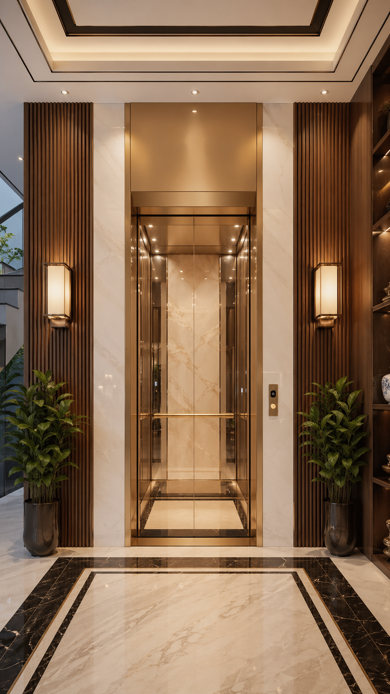

# Quy Trình Bảo Trì Thang Máy Gia Đình – Hướng Dẫn Chi Tiết Từ Chuyên Gia FUJI TH

Thang máy gia đình là khoản đầu tư dài hạn, đòi hỏi sự chăm sóc đúng cách để luôn hoạt động an toàn và bền bỉ. Nhiều chủ nhà thường bỏ qua việc bảo trì định kỳ, dẫn đến hư hỏng nghiêm trọng và chi phí sửa chữa cao. Bài viết này, FUJI TH sẽ hướng dẫn chi tiết quy trình bảo trì thang máy gia đình chuẩn an toàn, giúp bạn hiểu rõ từng bước và tầm quan trọng của việc bảo dưỡng định kỳ.

## Tại sao phải bảo trì thang máy gia đình định kỳ?

Thang máy gia đình hoạt động hàng ngày với tần suất trung bình từ 20–50 lần chạy/ngày. Theo thời gian, các bộ phận cơ khí, điện tử và hệ thống an toàn sẽ bị hao mòn tự nhiên. Việc bảo trì định kỳ giúp:

- **Phát hiện sớm hư hỏng** trước khi trở thành sự cố lớn
- **Kéo dài tuổi thọ thiết bị** lên đến 20–25 năm
- **Đảm bảo an toàn tuyệt đối** cho người sử dụng
- **Tiết kiệm chi phí** sửa chữa và thay thế linh kiện

Nếu bạn chưa có lịch bảo trì cố định, hãy tham khảo ngay [dịch vụ bảo trì thang máy FUJI TH](/dich-vu/bao-tri-thang-may) để được tư vấn miễn phí.

## Quy trình bảo trì thang máy gia đình chuẩn FUJI TH

Đội ngũ kỹ thuật FUJI TH thực hiện bảo trì theo quy trình 7 bước, tuân thủ tiêu chuẩn an toàn quốc tế:

### Bước 1: Kiểm tra tổng quan cabin và hệ thống cơ khí

Kỹ thuật viên kiểm tra toàn bộ cabin, ray dẫn hướng, cáp tải và đối trọng. Các chi tiết cần lưu ý:

- Cửa cabin và cửa tầng có đóng mở trơn tru không
- Ray dẫn hướng có bị mòn hay cong vênh không
- Cáp tải có bị sờn, rỉ sét hay đứt gãy không

### Bước 2: Kiểm tra hệ thống điện và điều khiển

Hệ thống điện là "bộ não" của thang máy. Kỹ thuật viên kiểm tra:

- Bảng điều khiển (PLC, biến tần)
- Hệ thống tín hiệu tầng và hiển thị
- Công tắc hành trình và cảm biến an toàn
- Hệ thống cứu hộ tự động (ARD)

### Bước 3: Bôi trơn các bộ phận chuyển động

Các chi tiết cần bôi trơn định kỳ:

- Ray dẫn hướng cabin và đối trọng
- Bánh xe con lăn (roller guides)
- Cửa cabin và cửa tầng (bản lề, thanh trượt)
- Hệ thống giảm chấn

### Bước 4: Kiểm tra hệ thống an toàn

Đây là bước quan trọng nhất trong quy trình bảo trì. Các thiết bị an toàn cần kiểm tra:

- **Công tắc quá tốc độ (Governor):** Ngắt khẩn cấp khi cabin chạy quá tốc
- **Bộ hãm khẩn cấp (Safety gear):** Giữ cabin trên ray khi cáp đứt
- **Đệm lò xo dưới hố PIT:** Giảm chấn khi cabin chạy xuống quá hành trình
- **Công tắc cửa (Door interlock):** Không cho thang chạy khi cửa chưa đóng kín

### Bước 5: Vệ sinh và làm sạch

Vệ sinh định kỳ giúp thang máy hoạt động êm ái và kéo dài tuổi thọ:

- Lau chùi cabin, tay vịn và sàn cabin
- Vệ sinh rail dẫn hướng và buồng máy
- Làm sạch hệ thống thông gió và chiếu sáng

### Bước 6: Kiểm tra và hiệu chỉnh

Sau khi bảo dưỡng, kỹ thuật viên tiến hành:

- Hiệu chỉnh tầng dừng chính xác
- Kiểm tra độ ồn và rung
- Test hệ thống cứu hộ khi mất điện
- Đo tải trọng và cân bằng đối trọng

### Bước 7: Lập biên bản và tư vấn

Kết thúc mỗi đợt bảo trì, FUJI TH cung cấp:

- Biên bản bảo trì chi tiết (ghi nhận tình trạng từng bộ phận)
- Danh mục linh kiện cần thay thế (nếu có)
- Lịch bảo trì tiếp theo
- Tư vấn nâng cấp hoặc cải tiến

## Tần suất bảo trì thang máy gia đình khuyến nghị

| Loại bảo trì | Tần suất | Nội dung chính |
|---|---|---|
| Bảo trì hàng tháng | 1 lần/tháng | Kiểm tra tổng quan, bôi trơn, vệ sinh |
| Bảo trì quý | 1 lần/3 tháng | Kiểm tra hệ thống điện, an toàn, hiệu chỉnh |
| Bảo trì đại tu | 1 lần/năm | Thay thế linh kiện hao mòn, kiểm tra toàn diện |

## Chi phí bảo trì thang máy gia đình

Chi phí bảo trì thang máy gia đình phụ thuộc vào nhiều yếu tố: loại thang, số tầng, tình trạng hiện tại và tần suất sử dụng. Tại FUJI TH, chúng tôi cung cấp [gói bảo trì trọn gói](/dich-vu/goi-bao-tri) với chi phí hợp lý, bao gồm:

- Bảo trì định kỳ hàng tháng
- Thay thế linh kiện hao mòn cơ bản
- Hỗ trợ kỹ thuật khẩn cấp 24/7

Để biết chi phí cụ thể, vui lòng [liên hệ FUJI TH](/lien-he) để được báo giá miễn phí.

## Những dấu hiệu cần bảo trì thang máy ngay lập tức

Nếu thang máy gia đình bạn xuất hiện các dấu hiệu sau, hãy liên hệ ngay với đội ngũ kỹ thuật:

- Thang phát ra tiếng ồn bất thường khi vận hành
- Cửa đóng mở không đều hoặc bị kẹt
- Cabin rung lắc hoặc dừng không chính xác tại tầng
- Đèn báo lỗi trên bảng điều khiển sáng liên tục
- Hệ thống cứu hộ không hoạt động khi test thử

## Kết luận

Bảo trì thang máy gia đình định kỳ là việc làm cần thiết để đảm bảo an toàn và kéo dài tuổi thọ thiết bị. Với quy trình 7 bước chuẩn quốc tế, FUJI TH cam kết mang đến dịch vụ bảo trì chuyên nghiệp, đáng tin cậy cho mọi gia đình.

**Đặt lịch bảo trì ngay hôm nay** để nhận ưu đãi 10% cho khách hàng lần đầu. Liên hệ hotline **0911.929.222** hoặc truy cập [trang liên hệ](/lien-he) để được tư vấn miễn phí.

---

*Bài viết thuộc chuyên mục [Thang máy gia đình](/thang-may-gia-dinh) – FUJI TH – Chuyên gia thang máy hàng đầu Việt Nam.*
